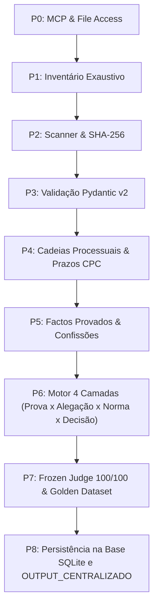

# Arquitetura e Organizacao Master: Ecossistema Forense, Societario e Multiagente

**Versao**: 3.0.0 Enterprise Master  
**Data de Publicacao**: 2026-08-28  
**Autoridade**: `C:\Users\Yokozuna\Dev\AGENTS.md` e `C:\Users\Yokozuna\Dev\AI\DIRETRIZES-GLOBAIS-DEV.md`  

---

## 1. Estrutura de Pastas e Hierarquia de Dados de Alta Performance

```text
C:\Users\Yokozuna\Dev\
├── 00_INDICE_E_MOCS/
│   ├── MOC_GERAL_SISTEMA.md
│   ├── MOC_PROCESSOS_JUDICIAIS.md
│   └── MOC_ENTIDADES_SOCIETARIAS.md
├── 01_PROCESSOS_JUDICIAIS/
│   ├── PROC_15547-26.0T8LSB/ (Reivindicacao e Propriedade Plena - Teresa Martins)
│   │   ├── 01_INICIAL/ (PI, Procuracoes, Taxas Citius)
│   │   ├── 02_CONTESTACAO/ (Defesa, Excecoes, Impugnacoes)
│   │   ├── 03_PROVAS/ (input/ [RAW imutavel], processed/ [OCR], output/ [Hashes])
│   │   ├── 04_ALEGACOES/ (Alegações de Facto e Direito)
│   │   ├── 05_SENTENCA/ (Despachos Saneadores, Sentencas)
│   │   └── 06_RECURSOS/ (Recursos TRL e STJ)
│   ├── PROC_3719-25.0T8LSB/ (Providencia Cautelar e Posse Habitacional)
│   ├── PROC_10153-24.7T8LSB/ (Oposicao a Execucao e Compensacao Unicre)
│   └── PROC_23142-22.7T8LSB/ (Nulidade Absoluta de Citacao)
├── 02_ENTIDADES_E_CORPORATE/
│   ├── SPARK_CELTIS_SCR_SA/ (Registo CMVM-SCR-7241, NIF 514892341)
│   ├── SPARK_CONTAINER_FUND_CMVM/ (Registo CMVM-FCR-9812)
│   ├── GROWTH_PARTNERS_CAPITAL/ (Sociedade de Investimento)
│   └── HOLDINGS_E_VEICULOS/ (Integritate, Nogui, Kora, Liz, Unicorn Re, Nomad)
├── 03_PROVAS_E_AUDITORIA_CRIPTOGRAFICA/
│   ├── CONFISSOES_E_WHATSAPP/ (Prova da Confissao de Filipe Delgado - Art. 358.º CC)
│   ├── CERTIDOES_PREDIAIS_E_COMERCIAIS/
│   └── MOVIMENTOS_BANCARIOS_E_TPA/ (Extratos Unicre, Comprovativos de Retencao)
├── 04_MEMORIA_E_BANCO_DE_DADOS/
│   ├── memoria_forense_unificada.db (SQLite Relacional Multi-Tabela)
│   ├── rag_index.db (Base Vetorial com 175.446 Chunks)
│   └── grafos_conhecimento/ (nodes.jsonl e edges.jsonl)
├── Projects/
│   ├── INGESTAO_15547_PRO/ (Pipeline Especializado do Proc. 15547)
│   ├── INGESTAO_SPARK_VENTURE/ (Classificador Societario e CMVM)
│   ├── RAG_FORENSE_SOCIETARIO/ (Motor de Busca Semantica e Chunks)
│   ├── LLM_WIKI_VAULT/ (Wiki Estruturada e Site Interativo)
│   └── AGENTE_HIGIENIZACAO_DESKTOP/ (Auditoria e Consolidacao de Relacoes)
└── OUTPUT_CENTRALIZADO/
    ├── 01_INDEX_E_RELATORIOS/ (Relatorios Forenses e Markdown)
    ├── 02_DADOS_ESTRUTURADOS/ (JSONL, BD SQLite e Grafos)
    ├── 03_LOGS_AUDITORIA/ (Audit Ledger e Logs de Erros)
    └── 04_DOCUMENTOS_CITIUS_E_PECAS/ (Pecas Judiciais e Certidoes Oficiais)
```

---

## 2. Ecossistema Multiagente e Pipeline Deterministico (P0 a P8 & T0 a T8)



### Mapa de Responsabilidades dos Agentes:
1. **Agente Scanner & Extrator**: Extrai metadados, texto integral, hashes SHA-256 e suporte de caminhos longos Windows.
2. **Agente Validador Pydantic**: Bloqueia inconsistências semânticas e segrega os 5 estados probatórios:
   - `FACTO_DOCUMENTADO` (Peso: 1.00)
   - `ALEGACAO` (Peso: 0.50)
   - `INFERENCIA` (Peso: 0.60)
   - `TESE_DEFESA` (Peso: 0.80)
   - `POR_VALIDAR` (Sob quarentena)
3. **Frozen Judge Agent (Score 100/100)**: Aplica as 5 Cláusulas Pétreas inegociáveis.
4. **Agente Graphify**: Mapeia a teia de relações entre Pessoas, Empresas, Processos e Imóveis.
5. **Agente RAG**: Indexa e recupera instantaneamente passagens cruciais em $175.446$ chunks.
6. **Agente LLM Wiki**: Gera documentação viva com artigos enciclopédicos interligados.
7. **Agente de Higienização**: Monitoriza a integridade das pastas e consolida novos ficheiros sem duplicações.

---

## 3. As 5 Cláusulas Pétreas de Governança

1. **Proc. 10153/24.7T8LSB**: Inexigibilidade da quantia exequenda face à retenção na fonte TPA Unicre (€ 52.285 retidos vs € 105.633 alegados).
2. **Proc. 23142/22.7T8LSB**: Nulidade absoluta da citação efetuada em morada fictícia/forjada.
3. **Proc. 15547/26.0T8LSB**: Propriedade plena de Teresa de Jesus Martins e litisconsórcio necessário de herdeiros.
4. **Proc. 3719/25.0T8LSB**: Tutela urgente de posse e habitação com confissão extrajudicial de desvio de rendas de Filipe Delgado.
5. **Regra 0 Criptográfica**: Proibição absoluta de fatos ou documentos sem hash SHA-256 verificado.
