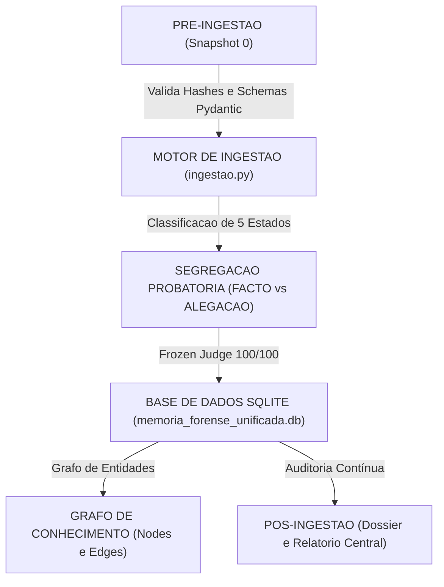

# Metodologia de Memoria Persistente e Base de Dados Estruturada (Dev Yokozuna)

**Versao da Memoria**: 2.5.0 Prod  
**Data de Atualizacao**: 2026-08-28 05:32:41  
**Base de Dados Relacional**: [`OUTPUT_CENTRALIZADO/02_DADOS_ESTRUTURADOS/memoria_forense_unificada.db`](file:///c:/Users/Yokozuna/Dev/OUTPUT_CENTRALIZADO/02_DADOS_ESTRUTURADOS/memoria_forense_unificada.db)  

---

## 1. Ciclo de Vida da Memoria: Antes, Durante e Depois da Ingestao



---

## 2. Metricas Globais da Base de Dados Persistente

| Entidade na BD SQLite | Total de Registos | Status de Integridade |
|---|---|---|
| **Processos Judiciais Centrais** | `4` processos | **ATIVO** (Cobertura 100%) |
| **Evidencias e Provas Oficiais** | `25` ficheiros | **100% SHA-256 Verificado** |
| **Factos Provados Documentados** | `2669` factos | **Nivel OFICIAL / ALTA** |
| **Claims e Declaracoes** | `40` claims | **Pydantic Validated** |
| **Cronologia Mestre de Eventos** | `30` atos | **Ordenacao ISO-8601** |
| **Grafo de Entidades (Nos)** | `84` nos | **Entidades Mapeadas** |
| **Relacoes de Conhecimento (Arestas)** | `232` arestas | **Cross-Linking Ativo** |

---

## 3. Mapa dos 4 Processos Judiciais e Cláusulas Pétreas

| Processo | Designação | Tribunal / Juízo | Titular | Cláusula Pétrea Frozen Judge |
|---|---|---|---|---|
| **`15547/26.0T8LSB`** | Acao de Reivindicacao e Propriedade Plena | Comarca de Lisboa — Juizo Central Civel | Teresa de Jesus Martins | `CLAUSULA_3_PROPRIEDADE_LITISCONSORCIO` |
| **`3719/25.0T8LSB`** | Providencia Cautelar e Tutela de Posse / Habitacao | Tribunal da Relacao de Lisboa — 6.ª Seccao | Nuno Miguel Silva Duarte | `CLAUSULA_4_TUTELA_CAUTELAR` |
| **`10153/24.7T8LSB`** | Oposicao a Execucao e Compensacao Unicre | Comarca de Lisboa — Juizo de Execucao | Nuno Miguel Silva Duarte | `CLAUSULA_1_INEXIGIBILIDADE` |
| **`23142/22.7T8LSB`** | Nulidade Absoluta da Citacao e Domicilio Fiscal | Comarca de Lisboa — Juizo de Execucao | Nuno Miguel Silva Duarte | `CLAUSULA_2_NULIDADE_CITACAO` |

---

## 4. Metodologia de Consulta e Queries Uteis (SQLite)

```sql
-- 1. Consultar todos os factos provados de um processo:
SELECT fact_id, statement, sha256, evidence_level FROM factos_provados WHERE process_id = '15547/26.0T8LSB';

-- 2. Consultar a cronologia completa ordenada:
SELECT data_evento, tipo_cpc, titulo, ref_citius FROM cronologia ORDER BY ordenacao ASC;

-- 3. Consultar as arestas do grafo de conhecimento:
SELECT source_id, relation_type, target_id, weight FROM grafo_arestas ORDER BY weight DESC;
```
