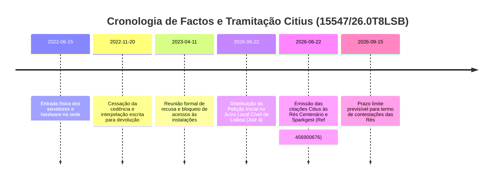

# TIMELINE PROCESSUAL DETALHADA: PROCESSO 15547/26.0T8LSB

---

## MARCOS CRONOLÓGICOS E TRAMITAÇÃO CITIUS

* **2022-06-15:** Aquisição e instalação de servidores na Avenida da Liberdade. Prova: `IMG_20220615_143022_RACK_SERVIDORES_LISBOA.jpg` com GPS (`38.722252, -9.139337`).
* **2022-11-20:** Interpelação formal enviada às gerências de ambas as Rés para agendamento de recolha de bens.
* **2023-04-11:** Recusa verbal em reunião de administração, gravada e preservada em `1681234567_REUNIAO_DIRECAO_SPARKGEST_RETENCAO.wav`.
* **2026-06-22:** Distribuição da Ação de Reivindicação no Tribunal Judicial da Comarca de Lisboa - Juízo Local Cível (Juiz 4).
* **2026-06-22:** Emissão eletrónica das notificações de citação Citius às Rés com referência `456900676`.
